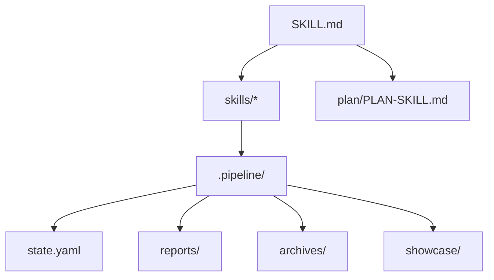

# Hypo-Workflow

把复杂 AI 工作拆成可恢复、可审查、可交付的工作流。

---

## 为什么需要它

- 多步骤 AI 任务容易丢上下文
- 中断后很难知道该从哪里继续
- Agent 容易跳过验证或自己补需求
- 项目交付需要状态、报告和历史，而不只是一次回答

---

## 方案概述

Hypo-Workflow 用本地 `.pipeline/` 把规划、执行、评估、归档串成稳定流程。

---

## 核心能力 1：可恢复 Pipeline

- `state.yaml` 记录当前 Prompt、步骤和心跳
- `PROGRESS.md` 面向人类展示进展
- `log.yaml` 记录生命周期事件
- `/hw:resume` 从保存状态继续

---

## 核心能力 2：Plan + Cycle

- Interactive Plan 强制提问和确认
- Milestone 在 Cycle 内独立编号
- Cycle 关闭后自动归档状态、Prompt、报告和摘要
- Deferred 项可注入后续计划

---

## 核心能力 3：Patch + Compact + Showcase

- Patch 轨道处理轻量修复
- Patch Fix 直接执行小修复，不进入 Milestone
- Compact 视图降低 SessionStart token 占用
- Showcase 一键生成介绍文档、技术文档、slides 和海报

---

## 架构图

---

## 使用流程

1. `/hw:setup`
2. `/hw:init` 或 `/hw:init --import-history`
3. `/hw:plan`
4. `/hw:start`
5. `/hw:status` / `/hw:resume`
6. `/hw:showcase --all`

---

## 版本历程

- V0-V2.5：TDD Pipeline、Subagent、Progressive Disclosure
- V3-V5.1：Hook、Multi-Dim Evaluation、Plan Mode、Notion
- V6-V7.1：Lifecycle、Dashboard、Setup Wizard
- V8.0-V8.3：Cycle、Patch、Compact、Guide、Showcase、i18n

---

## 下一步

- 让更多非开发 preset 使用同一工作流模型
- 完善 Showcase poster 的风格配置
- 持续压缩上下文加载成本
- 保持 Claude Code 和 Codex 双平台兼容

---

## 结束

Hypo-Workflow：让 AI Agent 的复杂工作可规划、可恢复、可验证、可展示。
