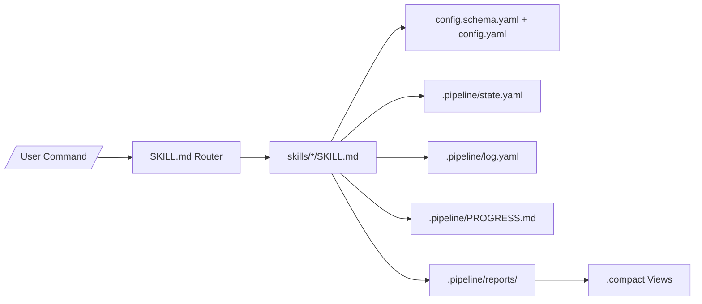

# Hypo-Workflow 技术文档

## 架构总览

Hypo-Workflow 是一个文件优先的 Skill 包。根入口 `SKILL.md` 负责命令路由和全局运行纪律，具体能力拆分到 `skills/*/SKILL.md`。运行时数据保存在项目本地 `.pipeline/`。

```text
Hypo-Workflow/
├── SKILL.md                    # 根入口、命令表、运行时规则
├── skills/                     # 30 个用户指令 + 内部 watchdog
│   ├── plan/                   # 规划入口
│   ├── start/ resume/          # Pipeline 执行
│   ├── cycle/ patch/           # 生命周期和旁路修复
│   ├── compact/ guide/         # 上下文压缩和交互引导
│   └── showcase/               # 项目展示物料生成
├── plan/PLAN-SKILL.md          # Plan Mode 二级入口
├── templates/{en,zh}/          # 多语言模板
├── hooks/                      # Claude Code Hook 集成
├── rules/                      # 内置规则、presets 和自定义规则模板
├── scripts/                    # 状态摘要、日志、diff、watchdog helper
├── config.schema.yaml          # 项目和全局配置 schema
└── .pipeline/                  # 项目本地状态、报告、归档和 showcase 产物
```

## 核心设计决策

1. **Skill 驱动而不是服务驱动**：工作流靠 Markdown 指令和本地文件运行，避免部署和远端状态依赖。
2. **Progressive Disclosure**：根入口只放核心规则，细节按需读取 references、templates、scripts 和 skill 子目录。
3. **状态文件可恢复**：`state.yaml` 是执行状态的事实来源，`log.yaml` 是生命周期日志，`PROGRESS.md` 是人类可读摘要。
4. **Cycle 与 Patch 分离**：Cycle 管理大块交付历史，Patch 管理小修复，避免所有事情都进入 Milestone。
5. **Compact 只读派生**：`.compact` 文件降低上下文开销，但永远不替代原始文件作为写入来源。
6. **i18n 模板优先级**：`output.language` 映射到 `templates/{lang}/`，缺失时回退根模板，旧项目行为不变。
7. **Rules 独立维度**：规则不再散落在 Hook、config 和 Skill 里，而是通过 `off/warn/error`、生命周期钩子和自定义 Markdown 统一管理。

## 关键数据流



执行 Pipeline 时，`/hw:start` 或 `/hw:resume` 读取配置、定位当前 Prompt、执行步骤、写入状态和日志。完成 Milestone 后生成 report，必要时执行 Plan Review，并根据阈值继续、停止或 defer。

## 指令参考精简版

- Setup：`/hw:setup`
- Pipeline：`/hw:start`、`/hw:resume`、`/hw:status --full`、`/hw:stop`
- Plan：`/hw:plan`、`/hw:plan --context audit,patches,deferred,debug`、`/hw:plan:extend`
- Lifecycle：`/hw:init --import-history`、`/hw:cycle`、`/hw:patch fix P001`
- Utility：`/hw:compact`、`/hw:guide`、`/hw:showcase --all`、`/hw:rules`、`/hw:dashboard`

完整参数和示例见项目 README。

## 扩展指南

### 添加新 preset

1. 在对应 Skill 中定义 preset 名称、步骤序列和选择规则。
2. 如果需要配置，追加到 `config.schema.yaml`，所有字段必须有默认值。
3. 把命令注册到根 `SKILL.md` 和 `references/commands-spec.md`。
4. 增加回归场景，确保 `claude plugin validate .` 和 regression 通过。

### 添加新 adapter

1. 在 `adapters/source/` 或 `adapters/output/` 定义契约。
2. 在配置 schema 中添加最小必要字段。
3. 在执行 Skill 中说明 fallback 行为，适配失败不能破坏本地输出。
4. 文档和测试要覆盖配置、错误处理和兼容性。

## 技术栈和依赖

- Markdown Skill 文件作为主要运行时规范。
- YAML 作为配置、状态、Cycle、Patch 和 Showcase 元数据格式。
- Shell scripts 提供轻量辅助能力。
- Claude Code Hook 用于 stop-check 和 SessionStart context injection。
- 可选 OpenAI GPT Image API 用于 Showcase poster。
